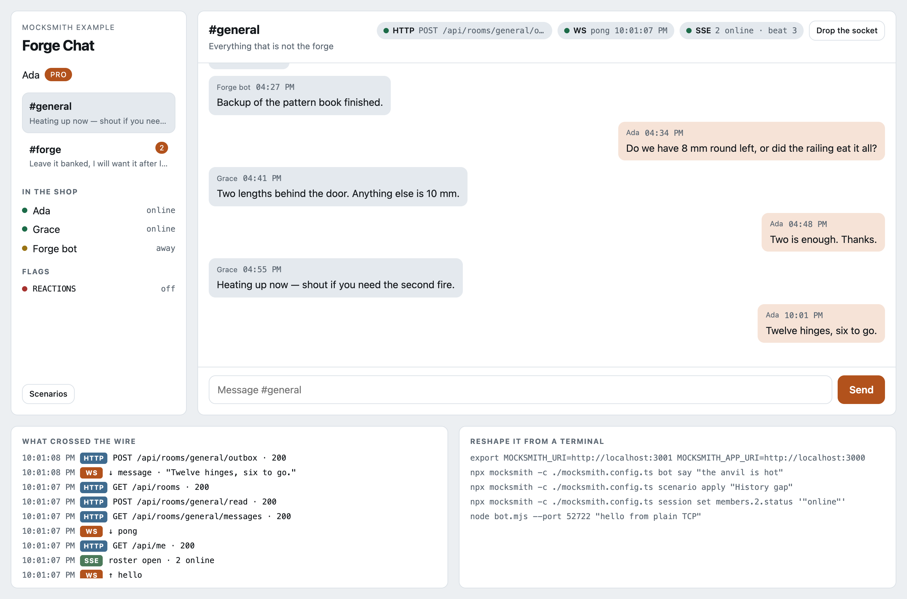
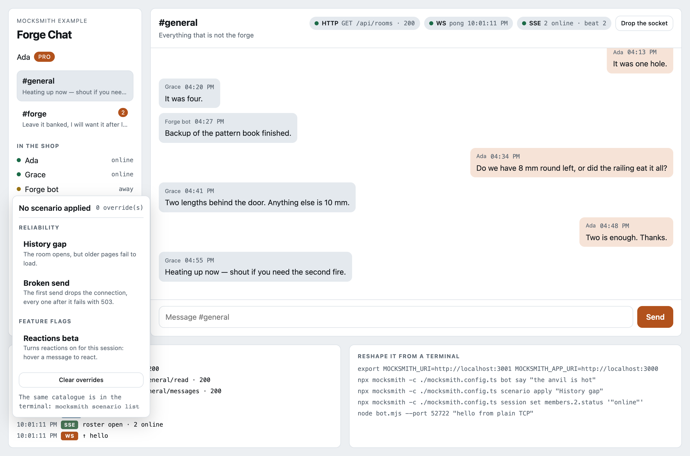

# Forge Chat — a mocksmith demo

A small React chat where **every** byte comes from mocksmith: history over HTTP,
messages and typing over a websocket, presence over SSE, and — for the clients
that speak neither — a plain TCP socket into the same world.

```bash
pnpm dev
```

One command starts the app and the mock server. The Vite plugin reserves a free
port pair, starts `mocksmith`, waits for its healthcheck and proxies `/api`,
`/sse`, `/ws` and `/__mocks` to it — so the app and the mocks share an origin
and the session cookie travels with every request.



## Every feature, and where it is on screen

| Feature | Where you see it |
| --- | --- |
| **HTTP handlers** | `GET /api/me`, `/api/rooms`, `/api/rooms/:id/messages`, `POST /api/rooms/:id/outbox`. Handlers read and write the session, so a message you send is really stored. |
| **WebSocket** | Messages, typing notices and roster changes arrive unasked. Open a second tab: it follows along without a reload, and its wire log shows the frame but no request of its own. |
| **SSE** | `/sse/presence` streams the roster once a second, straight from the session. `mocksmith session set members.2.status '"online"'` changes it live. |
| **Raw TCP** | `node bot.mjs --port <raw port> "hello"` — no HTTP, no cookies, same room. |
| **Sessions** | Every browser and every test gets its own world; the scenario you apply here is invisible to the tab next door. |
| **Overrides by query** | The `History gap` scenario breaks only `?before=…`, so the room opens and only scrolling back fails. |
| **Overrides by call number** | `Broken send` drops the connection once, then answers 503 forever. |
| **Feature flags** | `REACTIONS` is in the rail. The reactions endpoint refuses while it is off, so the flag is the feature — not a switch the UI decides to honour. |
| **Scenario catalogue** | The **Scenarios** button lists what the server knows and applies it to this session. |
| **Plugins** | `plugins/bot.ts` adds a system route and a CLI command: `mocksmith bot say "…"`. `plugins/chatter.ts` makes the room talk back on its own. |
| **Incoming traffic** | The `Busy room` scenario turns the chatter on: a line arrives every couple of seconds, over the socket, with nothing asked of the page. |
| **Socket diagnostics** | **Drop the socket** closes this session's sockets through `websockets/close`; the page notices and reconnects. |

Handlers are keyed by path only — the method is read from the request itself
(`handlers.ts`), and `:id` arrives in `requestData.urlParams`.

> **Why sending has a path of its own.** Overrides are keyed by path, not by
> method. If the composer posted to `/api/rooms/:id/messages`, a scenario
> breaking sending would break reading the room too — and "the message will not
> go, but the room is fine" is exactly the state worth testing. Hence
> `POST /api/rooms/:id/outbox`.

## Seeing it happen

The page keeps its own log — **what crossed the wire** — with one line per HTTP
call, per websocket frame (`↑ hello`, `↓ pong`, `↓ message`) and per change on
the stream. The SSE pill counts beats, so a number that keeps growing is the
liveness signal. Nothing has to be inspected to believe the demo.

Chrome's DevTools show the same thing, with two catches that make people think
the sockets are missing:

- **A websocket is only recorded while DevTools is open.** It is opened once, on
  page load, so open DevTools *first* and reload. Then it appears under the
  **Socket** (older Chrome: **WS**) filter as `ws`, and its frames are in the
  **Messages** tab of that entry — not as separate rows in the list.
- **SSE is one request, not one per event.** `/sse/presence` stays in the list
  as a single pending row; the events are in its **EventStream** tab.

To watch it from outside the browser instead:

```bash
# who is connected right now — websockets and raw sockets alike
curl -s -X POST http://localhost:3001/__mocks/api/websockets/state \
  -H 'content-type: application/json' -d '{"id":"default"}'

# push a frame into every socket of the session — the page changes with no request
curl -s -X POST http://localhost:3001/__mocks/api/sendToWebsocket \
  -H 'content-type: application/json' \
  -d '{"id":"default","data":{"data":{"type":"typing","typing":["Grace"]}}}'

# the stream, in the terminal
curl -N http://localhost:3001/sse/presence
```

That push changes the *page*, not the world — nothing was stored, and a reload
forgets it. `mocksmith bot say` does both: it appends the message to the session
**and** pushes the frame. That is the difference between a message and a
mutation.

## Reshape it while it runs

The commands are printed at the bottom of the page with the ports of your
running server already filled in. From `examples/vite-app`:

```bash
export MOCKSMITH_URI=http://localhost:<mock port> MOCKSMITH_APP_URI=http://localhost:<app port>

npx mocksmith -c ./mocksmith.config.ts bot say "the anvil is hot"
npx mocksmith -c ./mocksmith.config.ts scenario list
npx mocksmith -c ./mocksmith.config.ts scenario apply "Busy room"
npx mocksmith -c ./mocksmith.config.ts session set chatter.on false
npx mocksmith -c ./mocksmith.config.ts scenario apply "History gap"
npx mocksmith -c ./mocksmith.config.ts session set members.2.status '"online"'
npx mocksmith -c ./mocksmith.config.ts endpoint set /api/rooms/:id/outbox --status 503
npx mocksmith -c ./mocksmith.config.ts session reset

node bot.mjs --port <raw port> "hello from plain TCP"
```

`scenario apply` reloads the open page by itself: `mockReloadPlugin` turns the
CLI's request into a Vite full reload.

Worth watching once: apply `History gap`, and the room still opens. The rule
carries `when: { query: { before: '>0' } }`, and a request that matches no rule
is answered by the real handler — so only the walk backwards through history
fails.

## The same catalogue, inside the app



The **Scenarios** button is a dev panel built on the system API: `scenarios` to
list, `applyScenario` to apply, `clearScenario` to clear — the very routes the
CLI speaks. Every call names this tab's own session id (`/api/me` returns it),
which is why applying a scenario here leaves every other session alone.

The override count under the title comes back from the server on each change.
The scenario *name* does not: nothing on the server remembers which scenario was
applied, so that label is the page's own memory and a reload forgets it.

## When the room talks back

`Busy room` is the scenario that shows where the line between the two ideas
falls. It overrides no endpoint at all — it only patches the session with
`chatter: { on: true }`. A scenario is a description of the world, and a
description cannot tick; so `plugins/chatter.ts` watches that flag and does the
sending, a line every couple of seconds, appended to the session **and** pushed
into its sockets.

Two consequences worth knowing:

- **A session patch is not an override.** "Clear overrides" leaves the room
  talking. The switch under **Flags** turns it off (it writes to the world with
  `patchSession`, the route behind `session set`), and so do
  `mocksmith session set chatter.on false` and `mocksmith session reset`.
- **It survives a reload,** because each line is stored, not merely pushed. A
  bare `sendToWebsocket` would change the page and vanish on refresh.

## A native client, same world

`bot.mjs` speaks a line protocol over plain TCP:

```
SESSION <id>    bind to a session (omit it to stay on the default one)
SAY <text>      post a message into #general
```

Raw connections carry no cookies, so the session is named in a handshake line
and returning that context from the handler binds the connection to it. After
that the socket is bookkept exactly like a websocket — diagnostics,
`websockets/close` and the session-death poll all see it.

## Browser tests

```bash
pnpm test:e2e
```

Each test gets its own mock session, so they run in parallel without colliding.
They use the Chrome already installed on your machine; set `PLAYWRIGHT_CHANNEL`
to pick a different channel. The suite covers everything in the table above,
including the plugin route and the TCP client.

```bash
pnpm typecheck   # the demo is typechecked too, against the built packages
```

## Losing the server, and finding it again

Stop the mock server while the page is open and the pills tell you honestly:
HTTP goes amber, the websocket says `reconnecting…`, the stream says `closed`.
Start it again and the page recovers on its own — the socket reopens with a
backoff, and on reconnect it reloads the room, because the world may have moved
on while it was blind. **Drop the socket** stages the same thing on demand.

That behaviour is in `useWire.ts`, and two details there are worth stealing:

- **A websocket does not reconnect by itself.** `EventSource` does; `WebSocket`
  does not. Reconnecting is your job, and a backoff (1s, 2s, 4s, capped at 8s)
  keeps a dead server from becoming a busy loop.
- **A stalled SSE stream does not look like an error.** When the mock server
  dies behind the dev server's proxy, the browser is not told: the connection
  stays open and simply goes quiet, so no `error` event arrives and a naive
  indicator stays green over a dead stream. The stream beats once a second, so
  silence longer than five seconds is the signal — the page treats it as one and
  reopens.

## Worth knowing

- `main.tsx` does not use `StrictMode`. It double-invokes effects in
  development, which fires every request twice — a scenario answering "200
  first, then 503" would burn both responses on the first render.
- `abort: true` destroys the connection. Reaching the mock server directly that
  is a transport error with no status; behind the dev server's proxy the proxy
  answers with a 500 of its own. Both are a different branch from a 503.
- The mock server sends no CORS headers, which is why the app talks to it
  through the Vite proxy rather than a second origin.
- The host is `localhost` everywhere. Cookies treat `localhost` and `127.0.0.1`
  as different hosts, so mixing them makes session isolation fail silently.
- The raw socket needs a third port. `vite.config.ts` asks the OS for a free one
  unless `MOCKSMITH_RAW_PORT` says otherwise; the page prints whichever it got.
